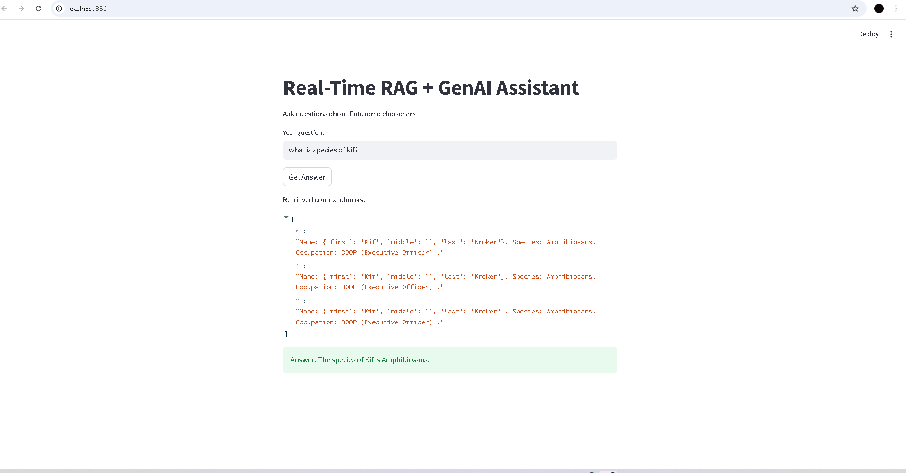

# Real-Time RAG Assistant (Kafka + FAISS + GenAI)

This project demonstrates a real-time RAG (Retrieval-Augmented Generation) pipeline:
- Fetch live data from an API
- Produce messages to Kafka (running in Docker)
- Consume messages, create embeddings (Sentence-Transformers), store in FAISS
- Query the FAISS index and generate answers using a local LLM (Ollama + Mistral)

All tools used are free / open-source.

---

## Prerequisites

- Python 3.10+
- Docker & Docker Compose
- Git (optional)
- Ollama installed and a local model (see steps)
- Enough disk space for models (~2–8GB depending on model)

---

## 1) Setup Python environment

```bash
cd real_time_rag_project
python -m venv .venv
source .venv/bin/activate   # Windows: .venv\Scripts\activate
pip install -r requirements.txt
docker-compose up -d zookeeper
docker-compose up -d kafka
docker exec -it kafka kafka-topics.sh --create --topic my_topic --bootstrap-server kafka:9092
docker exec -it kafka kafka-console-producer.sh --topic my_topic --bootstrap-server kafka:9092
docker exec -it kafka kafka-console-consumer.sh --topic my_topic --from-beginning --bootstrap-server kafka:9092
docker-compose up -d producer
docker-compose up -d consumer
python -m query.ask_rag
streamlit run app.py
 


